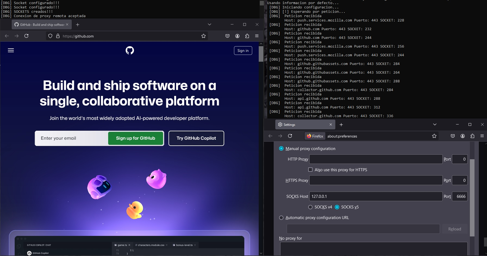

### ReverseProxy

Proxy inversa simple <i>(Parte de otro proyecto mas grande)</i>.

Hace uso de un solo socket entre el cliente y el servidor durante toda la interaccion.

 

### Estructura del paquete

Cada paquete que se envia entre ambos puntos va de la siguiente manera:

T  | D | SOCKET| SOCKET
------- | ----- | ----- | -----
4 BYTES | ... | 8 BYTES | 8 BYTES
Tama&ntilde;o del buffer | Datos a reenviar | Socket del navegador/cliente local | Socket del punto final

Hasta el momento se puede transferir el contenido completo de paginas web y logra cargar cierta parte de los videos en YouTube. Es inestable ya que sigue en fase de desarollo

Demo

